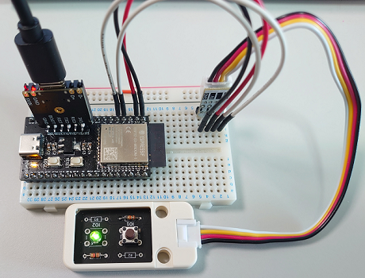

# ESP32-S3 ULP Sample

## 背景

platformioの[espressif32 Release 6.0.0](https://github.com/platformio/platform-espressif32/releases/tag/v6.0.0)から、ESP-IDF v5.0がサポートされたので、ULP RISC-Vを試してみた。

試すにあたり、"[ESP32-S3のULP-RISC-VでLチカしてみた](https://dev.classmethod.jp/articles/led-blink-on-esp32-s3-s-risc-v-ulp/)"を参考にさせていただいた。ありがとうございます！

## 環境
- [ESP32S3_DevBoard](https://github.com/kudotaka/ESP32S3_DevBoard)
- LED

## 写真


## 動作
```markdown
--- Terminal on COM17 | 115200 8-N-1
--- Available filters and text transformations: colorize, debug, default, direct, esp32_exception_decoder, hexlify, log2file, nocontrol, printable, send_on_enter, time
--- More details at https://bit.ly/pio-monitor-filters
--- Quit: Ctrl+C | Menu: Ctrl+T | Help: Ctrl+T followed by Ctrl+H
12:43:59.542 > ESP-ROM:esp32s3-20210327
12:43:59.554 > Build:Mar 27 2021
12:43:59.554 > rst:0x1 (POWERON),boot:0x8 (SPI_FAST_FLASH_BOOT)
12:43:59.563 > SPIWP:0xee
12:43:59.563 > mode:DIO, clock div:1
12:43:59.563 > load:0x3fce3810,len:0x167c
12:43:59.568 > load:0x403c9700,len:0xbe8
12:43:59.568 > load:0x403cc700,len:0x2e98
12:43:59.568 > entry 0x403c9904
12:43:59.575 > I (25) boot: ESP-IDF 5.0.0 2nd stage bootloader
12:43:59.575 > I (25) boot: compile time 12:25:59
12:43:59.581 > I (25) boot: chip revision: v0.1
12:43:59.586 > I (26) boot_comm: chip revision: 1, min. bootloader chip revision: 0
12:43:59.592 > I (34) boot.esp32s3: Boot SPI Speed : 80MHz
12:43:59.597 > I (38) boot.esp32s3: SPI Mode       : DIO
12:43:59.603 > I (43) boot.esp32s3: SPI Flash Size : 16MB
12:43:59.608 > I (48) boot: Enabling RNG early entropy source...
12:43:59.614 > I (53) boot: Partition Table:
12:43:59.614 > I (57) boot: ## Label            Usage          Type ST Offset   Length
12:43:59.625 > I (64) boot:  0 nvs              WiFi data        01 02 00009000 00006000
12:43:59.631 > I (72) boot:  1 phy_init         RF data          01 01 0000f000 00001000
12:43:59.636 > I (79) boot:  2 factory          factory app      00 00 00010000 00100000
12:43:59.647 > I (87) boot: End of partition table
12:43:59.647 > I (91) boot_comm: chip revision: 1, min. application chip revision: 0
12:43:59.659 > I (98) esp_image: segment 0: paddr=00010020 vaddr=3c020020 size=08f84h ( 36740) map
12:43:59.664 > I (113) esp_image: segment 1: paddr=00018fac vaddr=3fc91e00 size=02b18h ( 11032) load
12:43:59.675 > I (117) esp_image: segment 2: paddr=0001bacc vaddr=40374000 size=0454ch ( 17740) load
12:43:59.681 > I (127) esp_image: segment 3: paddr=00020020 vaddr=42000020 size=1ab50h (109392) map
12:43:59.702 > I (151) esp_image: segment 4: paddr=0003ab78 vaddr=4037854c size=0988ch ( 39052) load
12:43:59.711 > I (160) esp_image: segment 5: paddr=0004440c vaddr=50001000 size=00010h (    16) load
12:43:59.717 > I (161) esp_image: segment 6: paddr=00044424 vaddr=600fe000 size=0003ch (    60) load
12:43:59.727 > I (172) boot: Loaded app from partition at offset 0x10000
12:43:59.734 > I (172) boot: Disabling RNG early entropy source...
12:43:59.739 > I (189) cpu_start: Pro cpu up.
12:43:59.739 > I (189) cpu_start: Starting app cpu, entry point is 0x403758b8
12:43:59.747 > I (0) cpu_start: App cpu up.
12:43:59.755 > I (203) cpu_start: Pro cpu start user code
12:43:59.755 > I (204) cpu_start: cpu freq: 160000000 Hz
12:43:59.759 > I (204) cpu_start: Application information:
12:43:59.765 > I (207) cpu_start: Project name:     ESP32S3_IDF6_ULP
12:43:59.771 > I (212) cpu_start: App version:      fd5f380
12:43:59.776 > I (217) cpu_start: Compile time:     Jan 22 2023 12:24:59
12:43:59.781 > I (223) cpu_start: ELF file SHA256:  ad2d526ad6eb9ef8...
12:43:59.788 > I (229) cpu_start: ESP-IDF:          5.0.0
12:43:59.793 > I (234) heap_init: Initializing. RAM available for dynamic allocation:
12:43:59.798 > I (241) heap_init: At 3FC95340 len 000543D0 (336 KiB): D/IRAM
12:43:59.805 > I (248) heap_init: At 3FCE9710 len 00005724 (21 KiB): STACK/DRAM
12:43:59.815 > I (254) heap_init: At 3FCF0000 len 00008000 (32 KiB): DRAM
12:43:59.821 > I (261) heap_init: At 600FE03C len 00001FC4 (7 KiB): RTCRAM
12:43:59.826 > I (268) spi_flash: detected chip: gd
12:43:59.831 > I (271) spi_flash: flash io: dio
12:43:59.831 > I (276) sleep: Configure to isolate all GPIO pins in sleep state
12:43:59.843 > I (282) sleep: Enable automatic switching of GPIO sleep configuration
12:43:59.849 > I (289) cpu_start: Starting scheduler on PRO CPU.
12:43:59.855 > I (0) cpu_start: Starting scheduler on APP CPU.
12:43:59.860 > Not a ULP-RISC-V wakeup, initializing it!
12:43:59.860 > Entering in deep sleep
12:43:59.862 >
```